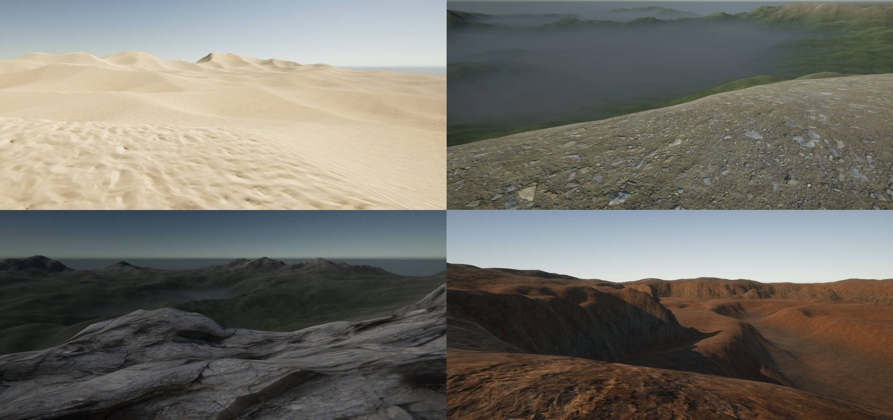
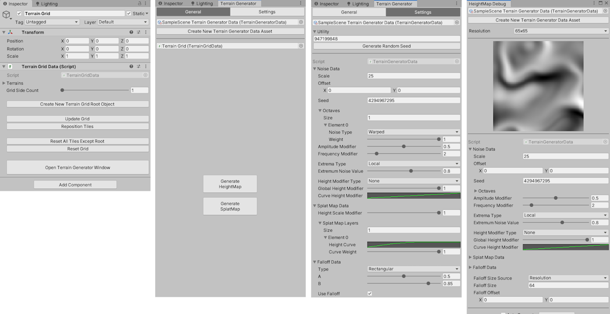

# Terrain Generator Tool for Unity

## About

The **Terrain Generator** is a prototype of a tool for Unity Editor that uses **Procedural Content Generation (PCG)** algorithms for terrain generation. It was made as a part of my Computer Science degree **engineering thesis** on implementing PCG in computer games. It uses various **CPU-based noise generation** algorithms to generate terrain using the Terrain API provided by the Unity Engine/Editor. The generation process has **multi-threading** implemented, and there is a debug tool to test the settings.

The tool is distributed as a UPM package. You can download it from the releases.

Beside thesis, it was used to make a game called [Roadside](https://m-biernat.itch.io/roadside).

## Features

 - Terrain generation using fractal noise, domain warping and ridging;
 - Ability to choose between Perlin, Simplex, and Cellular noise algorithms;
 - Large control over generator parameters (e.g. curve modifiers);
 - Managing multiple Terrain objects in the scene;
 - Multi-terrain generation on separate threads;
 - Rectangular and radial terrain falloff;
 - Simple texturing with splat maps;
 - Editor UI with SO profiles storing generator settings;
 - Full compatibility with other plugins and tools;
 - Debug tool for testing generator settings.

*The tool is a prototype made for engineering thesis and may not be suitable for more serious projects.*

## Installation & Usage

* Download the `Terrain Generator.zip` file;
* Unzip it in the `Packages` directory in the Unity project directory;
* Check if the plugin is installed in the *Package Manager* window;
* Attach a *Terrain Grid Data* component to an empty game object or an existing terrain;
* Set up the *Terrain* settings and *Terrain Layers* (if you use *Splat Map*);
* Open *Terrain Generator* window and create a new profile;
* Adjust *Noise*, *Splat Map* and *Falloff* settings;
* Open *HeightMap Debug* window from *Window* menu (optionally);
* Generate *HeightMap* and *SplatMap*.

*The tool may not work properly in Unity versions newer than 2019.3.*

## Tools & Dependencies

 - [Unity 2019.3.5](https://unity.com/releases/editor/whats-new/2019.3.5) - game engine/editor;
 - Unity Mathematics package.

## Credits

 - **Michał Biernat** @[m-biernat](https://github.com/m-biernat)

## License

All rights reserved ([no license](https://choosealicense.com/no-permission/)): 
 - You **can** view (peek into the code and assets) and fork this repository;
 - You **cannot** reproduce, distribute, or create derivative works;
 - You **can** use the tool (*"Terrain Generator"*) in your projects free of charge.
